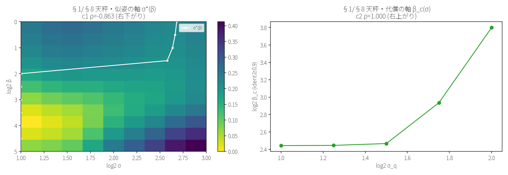

# ayaram-prototype

Ayaram minimum prototype **v0.1** — software simulation of a 3-layer
Hopfield network in PyTorch, designed to verify the Hopfield ↔ Attention
equivalence (Ramsauer 2020) under the aya-sleep stochastic dynamics.

This is the first behavioral demo of Ayaram.

The material below documents **v0.1**. The current release is **v0.2.0** —
see the section immediately following.

---

# v0.2 — scale-space integration (尺跨ぎ)

*Current release: `v0.2.0` (merge `88d8638`).* Of the four map operators — the
wall, the **scale-crossing** (尺跨ぎ), the nesting, the parallel — v0.2 implements
and *measures* the one that existed in no computational system: scale-crossing,
via the integration of scale-space theory into the v0.1 Modern Hopfield. The
architecture is unchanged; only the cargo is swapped — each layer's memory goes
from hand-carved abstractions (radicals, etymology) to scale bands that heat
grows.

The arc is six verbs: **melt (M1) → band (M1b) → stack (M2) → return (M3) →
balance (M4) → re-run (M5)** — 溶ける・帯・積む・帰る・天秤・再演.

## Four-line conclusion

1. **The balance is real.** Between the recall inverse-temperature β and the
   input scale σ there are two monotone correspondences — a *similarity axis*
   (c1: confusion-structure map σ\*(β), Spearman ρ = **−0.863**, descending) and
   a *cost axis* (c2: equi-discrimination β_c(σ), ρ = **+1.000**, ascending).
   Both pre-registered, both hit (p < 0.0001). **This machine cools its recall
   to keep telling things apart whenever its input is heated.**
2. **Scale-crossing recall works.** Cross-scale recall between memory banks is
   off-diagonal **0.92–1.00** within the plateau (chance 4.2%); the true
   wall-crossing from the texture band is **0.875**.
3. **Records run backwards.** The merge genealogy alone — the ledger of where
   trajectories join — returns **52.6%** of the form and **79.2%** of the
   identity. The tree remembers the path and forgets the stride; the forgotten
   stride is recovered by the memory's basin.
4. **Where the wall and the parts live.** There is exactly one σ-axis wall
   (texture | structure). The human part-hierarchy does not live in σ
   coordinates — it lives in the merge genealogy, the topology of confluence.



*The balance: c1's distance-valley map σ\*(β) (descending) beside c2's
equi-discrimination β_c(σ) (ascending).*

## Reproduce (the instrument and the watchman)

The whole arc re-computes from `data/glyphs_128/glyphs_128.npz` — nothing is
copied from prior results.

```bash
# the instrument: regenerate all 13 arc figures + the 5 re-proof asserts (~15 s)
uv run python demos/regenerate_m5_materials.py

# the watchman: the 5 numbers only, no figures, as a pytest guard (~11 s)
uv run python demos/regenerate_m5_materials.py --no-figures
uv run pytest tests/test_v02_regression.py    # test_v02_arc_reproof
```

The five re-proof numbers (a v0.3 change that breaks the arc fails fast):
c1 ρ = −0.863 ± 0.005 · c2 ρ = 1.000 · B1 off-diagonal min = 0.917 ± 0.005 ·
M3-2 fidelity mean = 0.526 ± 0.005 · windowed Silverman p > 0.05.

## Release

Annotated tag **`v0.2.0`** on merge commit `88d8638`. Milestone arc (8 commits):

```
d404124 → 71dbf6d → 119e162 → d4936ef → 3aaabac → 76cc151 → 9db7d4b → 1e8f929
 (v0.1.5   M0        M1        M1b       M2        M3        M4        M5 mat.)
  merge)
```

Measurement: ~145 s (M1–M4). CPU-deterministic; the control sweep uses recorded
seeds. Tests grew 117 → 135, unbroken at every step.

## What is claimed, and what is not (defensible line, §9-3)

**Claimed.** Scale-crossing recall (plateau 0.92+, one wall-crossing point
0.875); the single-band structure on the σ axis; that this representation is *a
positional eye* (fixed by a pre-registered control — shape-similar pairs beat
part-sharing pairs); the tree-only replay's 52.6% / 79.2%; the two arms of the
balance (both pre-registered, both hit).

**Not claimed.** **What crossed is recall, not a change of description** — v0.2
built the tower of scales and the movement/reference within it, not the full
"…………" where the measuring stick itself is re-pinned. This representation
carries no part *meaning* (a limit, established by B2, not a claim). The physical
heat K_u(T) bridge is **not** built (the control is a flat NULL). Generality is
limited to **24 kanji, a single font, 128 px, one writing system**.

## Bibliography (principal sources)

- **Iijima, T. (1959 / 1962)** — the first axiomatic derivation of linear
  scale-space, in Japan, inside character-recognition research (source and
  testbed shake hands).
- **Lindeberg, T. (1994 / 1998)** — scale-space theory and feature detection
  with automatic scale selection (the γ-normalized LoG convention used here).
- **Ramsauer et al. (arXiv 2020 / ICLR 2021)** — Modern Hopfield ≡ attention;
  the recall operator v0.2 stores its scale bands in.
- **Rissanen, Heinonen, Solin (ICLR 2023)** — generative modelling with inverse
  heat dissipation (the relative of the §7 backward replay).

---

## Purpose (from the requirements doc)

> アヤラムの基本動作を、PyTorch のソフトウェアシミュレーションで実装・検証する。
> 検証する核心は、Hopfield 網（連想記憶のモデル）と Attention（LLM の核演算）の
> 数学的等価性（Ramsauer 2020 で示された）が、aya-sleep の揺らぎを含む確率的計算
> でも成立するか、という点。

## Design decisions (Aya + Yu, 2026-06-17)

These six decisions take precedence over the original requirements doc
wherever the two disagree. In particular: the original "lower layer =
aya-sleep relevant, upper layer = aya-awake relevant" framing and the
"Hebb rule" framing are **superseded** by decisions #1 and #2 below.

| # | Topic | Decision |
|---|-------|----------|
| 1 | 3-layer interpretation | **C** — whole-cell synchronous switching (per the minimum design). The 3 layers form an MLP-style hierarchy; per-layer barrier differences exist to enrich representation, not to drive the cycle. v0.2 may shift to per-layer time-scale separation (option A) without breaking this interface. |
| 2 | Learning rule | **B primary** — Modern Hopfield continuous update (Ramsauer 2020). **C secondary** — classical Hebb rule kept in parallel for comparison experiments. |
| 3 | Scale | Cell 32×32, layer widths 1024 / 256 / 64, start with 8 kanji. |
| 4 | Equivalence check | **B** — directly verify Ramsauer 2020 Theorem 3, plus a sweep that maps the softmax inverse temperature β to the aya-sleep noise strength σ. |
| 5 | Kanji input | **A** — grayscale bitmap (16×16 or 32×32). SVG / CHISE inputs are deferred to v0.2. |
| 6 | Physical constraints | **B** — symmetry only (enforce W = Wᵀ every step). Full physical realism deferred to v0.2. |

## Milestones

- **M0 — DONE** — scaffold. Package skeleton, dependencies pinned, smoke
  test green, CUDA + RTX 5090 verified.
- **M1 — DONE** — implement `ayaram.{core, modes, learning, memory}`,
  Modern Hopfield + classical Hebb side by side, kanji associative recall,
  Ramsauer 2020 Theorem 3 verification (max abs diff = 0.000e+00), β ↔ σ
  correspondence map.
- **M2 — DONE** — `ayaram.ising` (Ising / MAX-CUT problem objects) and
  `demos/ising_solver.py` solving Lucas-2014 MAX-CUT via the 4-phase cycle
  on the classical Hebb side.
- **M3 — DONE** — `ayaram/encoding.py`, hierarchical Hebb learning
  (`HopfieldNetwork.learn`), Phase 1 `learn=True` variant, and
  `demos/hierarchical_kanji.py` for the forward (kanji → radical → origin)
  and reverse (radical → kanji) demos plus per-layer K_u dynamics.
- **M4 — DONE** — Option B orthogonal `(radical, count)` encoding
  (`encode_radical_count_v15`), `HopfieldNetwork.learn(normalize_inter=...)`
  formalization, 12-kanji expanded set (`data/kanji_hierarchy_v15.py`,
  added 森・水・川・山, new origin 地形), `demos/hierarchical_kanji_v15.py`
  with M3 vs M4(8) vs M4(12) bar-chart comparison. Layer-2 origin recall
  improved from M3 4/8 to M4-12 10/12 (83 %).
- **M5 — DONE** — `HopfieldNetwork.learn(center_inter_inputs=True)`
  formal API (the M4 demo helper promoted into the package),
  `demos/reverse_recall.py` for radical → kanji reverse direction
  (Modern top-3 radical-hit = 2/7, Hebb 0/7 → documented partial
  success). Comparison chart regenerated with `l1_cos` as the primary
  metric (Aru M5 sub-decision #1). Evaluation-report material in
  `demos/output/exec_summary_numbers.md`; text drafting handed to
  Aru + Aya + Yu.

## Workflow

```
綾＋ユウ (judgment)  →  アル (Chat, integrator)  →  CC (implementation)  →  Vault report
```

Every milestone closes with a `_tmp-m<n>-report.md` written to
`D:\SYRINX-Vault\50-projects\53-new-llm\`.

## Layout

```
ayaram-prototype/
├── README.md
├── pyproject.toml
├── .python-version
├── .gitignore
├── ayaram/
│   ├── __init__.py
│   ├── core.py          # whole-cell synchronous 4-phase cycle (decision #1)
│   ├── modes.py         # aya-awake / aya-sleep switching, T and σ (decisions #1, #4)
│   ├── learning.py      # Modern Hopfield continuous + classical Hebb (decision #2)
│   ├── memory.py        # 3-layer Hopfield net + learn(normalize_inter, center_inter_inputs)
│   ├── ising.py         # MAX-CUT / Ising problem objects for the 4-phase cycle
│   └── encoding.py      # layer-1 radical + layer-2 origin encoders (M3 + M4 Option B)
├── data/
│   ├── __init__.py
│   ├── generate_kanji.py            # reproducible build of the M1 kanji bitmap dataset
│   ├── kanji_8_32x32.npy            # M1: 人木口川火山日月  (8, 32, 32) float32 [-1, +1]
│   ├── kanji_hierarchy.py           # M3 radical / origin dictionaries
│   ├── generate_kanji_v2.py         # M3 bitmap generator
│   ├── kanji_8_32x32_v2.npy         # M3: 木日月火林明炎晶  (8, 32, 32) float32 [-1, +1]
│   ├── kanji_hierarchy_v15.py       # M4 extended dictionaries (12 kanji, 7 radicals, 4 origins)
│   ├── generate_kanji_v15.py        # M4 bitmap generator
│   └── kanji_12_32x32_v15.npy       # M4: + 森 水 川 山 (12, 32, 32) float32 [-1, +1]
├── demos/
│   ├── kanji_memory.py             # decision #5
│   ├── attention_test.py           # decision #4
│   ├── ising_solver.py             # Lucas-2014 MAX-CUT via Hebb-mode 4-phase cycle
│   ├── hierarchical_kanji.py       # M3 forward / reverse / dynamics demo
│   ├── hierarchical_kanji_v15.py   # M4 forward + M3 vs M4 comparison
│   ├── reverse_recall.py           # M5 reverse direction (radical -> kanji)
│   └── output/                     # generated artifacts (gitignored)
└── tests/
    ├── test_smoke.py
    ├── test_modes.py
    ├── test_learning.py
    ├── test_memory.py
    ├── test_core.py
    ├── test_ising.py
    ├── test_hierarchical.py
    ├── test_encoding_v15.py
    ├── test_learn_spectral.py
    └── test_learn_centering.py
docs/
├── design_decisions.md      # M0-M5 decisions + CC deviations log
├── stats.md                 # LOC / test count / runtimes / deps
├── cycle_concept.py         # renders cycle_concept.png
└── cycle_concept.png        # 4-phase cycle schematic
```

## Requirements

- Python ≥ 3.10
- [uv](https://docs.astral.sh/uv/) for environment management
- PyTorch built against CUDA 12.8 (cu128) — required for RTX 5090
  (Blackwell, sm_120)

## Setup

```bash
cd D:\projects\ayaram-prototype
uv sync
```

`uv sync` will create `.venv/`, install the dependencies from
`pyproject.toml` (using the cu128 PyTorch index for `torch`), and install
the project itself in editable mode.

## Verification

```bash
# Full test suite (97 tests, finishes in ~2 s on RTX 5090 / CPython 3.12)
uv run pytest

# CUDA + RTX 5090 visible to PyTorch
uv run python -c "import torch; print(torch.cuda.is_available(), torch.cuda.get_device_name(0))"
```

## Running the demos

All demos write their PNGs / NPZs into `demos/output/` (gitignored, kept
alive by `.gitkeep`). Runtimes are measured on RTX 5090.

```bash
# M1 -- Theorem 3 verification + β-σ map (Part B ~7 min, Part C ~22 s)
uv run python demos/attention_test.py

# M1 -- kanji associative recall (Modern vs Hebb)
uv run python demos/kanji_memory.py

# M2 -- MAX-CUT on N in {8, 16, 32} x 10 trials (~10 s)
uv run python demos/ising_solver.py

# M3 -- hierarchical kanji recall, original M3 set (~3 s)
uv run python demos/hierarchical_kanji.py

# M4 / M5 -- M3 vs M4(8) vs M4(12) comparison with l1_cos as primary (~4 s)
uv run python demos/hierarchical_kanji_v15.py

# M5 -- reverse recall: radical -> kanji
uv run python demos/reverse_recall.py

# Documentation figure (4-phase cycle schematic)
uv run python docs/cycle_concept.py
```

## v0.2 への宿題（M5 時点で再整理）

v0.1 中に着地済（fix）：

- **Inter-layer weight の spectral 正規化** -- M3 で CC 工夫として導入したものを
  M4 で `HopfieldNetwork.learn(normalize_inter='spectral')` として正式化（デフォルト）。
- **整数 multi-hot の同軸縮退** -- M3 で発見、M4 で Option B（直交 radical + 部首毎
  unary count）encoding を導入して解消。`test_v15_*` で断言。
- **層 0 bipolar bitmap の背景バイアス（一次対応）** -- M3 で発見、M4 demo helper、
  M5 で `HopfieldNetwork.learn(center_inter_inputs=True)` として本体組込。

各 v0.2 宿題は「**M○○ で見えた問題**」と「**v0.2 でどう解決見込み**」を
1 文ずつで提示。

1. **物理層対応の再設計**
   - **M1 で見えた問題**：`CycleConfig.sigma_global` を「layer-0 実効ノイズ std」と
     工学的に解釈、物理式 `sigma_local(l, T) = sqrt(T / K_u_l)` は記録用にしか乗らず、
     T_global は `AWAKE` / `SLEEP` の二点固定。
   - **v0.2 でどう解決見込み**：`sigma_global * sigma_local(l, T_global)` を
     `core.phase2_fluctuation` で物理通りに掛け、`T_global` を `CycleConfig` の
     sweep 軸として扱う。これが MTJ array シミュレーション (mumax3) 連携の前提。
2. **β 依存性の容量極限実験**
   - **M1 で見えた問題**：β-σ 20×20 grid のどこでも β を変えても recall は動かず、
     M1 Part C 狭域 sweep でも遷移しきい付近で β 依存性が出ない。
   - **v0.2 でどう解決見込み**：類似字形（一・二・三、口・日・目 等）を含む漢字セットで
     再測定し、Ramsauer 2020 Theorem 2 系の指数容量限界点を探索。N を増やすほど β-σ
     相転移しきいが動く挙動が捉えられる見込み。
3. **複数 seed 化による robustness 主張**
   - **M1 で見えた問題**：`demos/kanji_memory.py` は seed=0 で「Modern cos 1.000、
     Hebb cos 0.903」を出すが、単一試行なのでばらつきを主張できない。
   - **v0.2 でどう解決見込み**：M5 評価レポートと並行して 10 seed 以上で再走、
     平均±std で記述。実装は demo の trial loop に seed 軸を 1 つ足すだけ。
4. **MAX-CUT 以外の Lucas-2014 マッピング**
   - **M2 で意図的に除外**：M2 では MAX-CUT 1 例 (Erdős–Rényi p=0.5) のみで
     `ayaram.ising` API の汎用性は未検証。
   - **v0.2 でどう解決見込み**：TSP、3-SAT、グラフ彩色を `IsingProblem` の subclass
     として追加し、`demos/ising_solver.py` のフレームに乗せ替える。M2 の CC 所見通り、
     Modern 側に乗せるには別途「パターン辞書」のパラダイム転換が必要。
5. **MAX-CUT 焼き鈍しスケジュール**
   - **M2 で見えた問題**：σ=1.0 固定で N=32 の lift over random が 1.249× に頭打ち、
     N が大きいほど大域最適から離れる傾向。
   - **v0.2 でどう解決見込み**：Phase 2 内で σ を時間減衰する schedule
     （`sigma(t) = sigma_0 * cooling(t)`）を `CycleConfig` に追加。古典焼き鈍しと
     同じ原理。
6. **CHISE 自動部首分解 + 漢字数 100+ への拡張**
   - **M4 で見えた問題**：手作り辞書 `data/kanji_hierarchy_v15.py` は 12 字までは
     維持できるが、字数を増やすと辞書記述コストが線形に増える。
   - **v0.2 でどう解決見込み**：CHISE（漢字構造データベース）経由で意符＋音符の
     二軸自動分解、`KANJI_RADICALS` 等の辞書を CHISE クエリで生成するヘルパーを書く。
7. **`{0, 1}` alphabet と zero-centering の最終形**
   - **M3 で見えた問題**：bipolar `{-1, +1}` 背景が層間 Hebb 信号を汚染する。M3 で
     `{0, 1}` 表現を試行して層 0 Hebb が劣化、M4 で zero-centering に切替えて
     `learn(center_inter_inputs=True)` として M5 で本体組込。
   - **v0.2 でどう解決見込み**：物理層対応 (#1) と合わせて、状態 alphabet を
     MTJ の double-well 物理を素直に反映した連続値（`tanh` の像）に統一。
     centering は「物理ノイズ平均除去」として自然に再解釈される。
8. **逆方向想起の完全動作化**
   - **M5 で見えた問題**：M5 `demos/reverse_recall.py` で計測したところ、Modern
     top-3 radical-hit = 2/7（部分成功）、Hebb 0/7。M4 の改善が順方向には効くが
     逆方向は依然 attractor collapse が残る。
   - **v0.2 でどう解決見込み**：逆方向用に別 `W_inter` の re-normalization
     （forward 重みの正方向と逆方向で別 spectral norm を持つ）を導入、または
     `_inter_layer_signal` で forward / backward を独立スケールにする。
9. **Hebb モードの zero-centered 学習耐性**
   - **M4 + M5 で見えた問題**：`center_inter_inputs=True` を `mode='hebb'` で使うと
     `tanh(β W ξ)` の固定点符号が反転し、layer 1 cos が負値に落ちる。M5
     `test_hebb_with_centering_is_documented_caveat` で挙動を pin。
   - **v0.2 でどう解決見込み**：Hebb 専用の centering 軸 (`p_l - mean(p_l)` ではなく
     `tanh^-1(...)` 経由の補正項) を別 API として用意。Modern と Hebb が同じ
     learn pathway を共用するのが本当に正しいかも含めて再検討。

## References

- Hopfield, J. J. (1982). "Neural networks and physical systems with
  emergent collective computational abilities." *PNAS* 79(8), 2554–2558.
- Ramsauer, H. et al. (2020). "Hopfield Networks is All You Need."
  arXiv:2008.02217.
- Lucas, A. (2014). "Ising formulations of many NP problems."
  *Frontiers in Physics* 2:5.

## Related documents

- `D:\SYRINX-Vault\50-projects\53-new-llm\アヤラム ミニマム試作 v0.1 — 実装依頼書.md`
- `D:\SYRINX-Vault\50-projects\53-new-llm\アヤラム最小設計 v0.1.md`
- `D:\SYRINX-Vault\53-new-llm\新LLM.md`

## License

MIT License — see [LICENSE](LICENSE).

Copyright (c) 2026 uminoyu-lab
